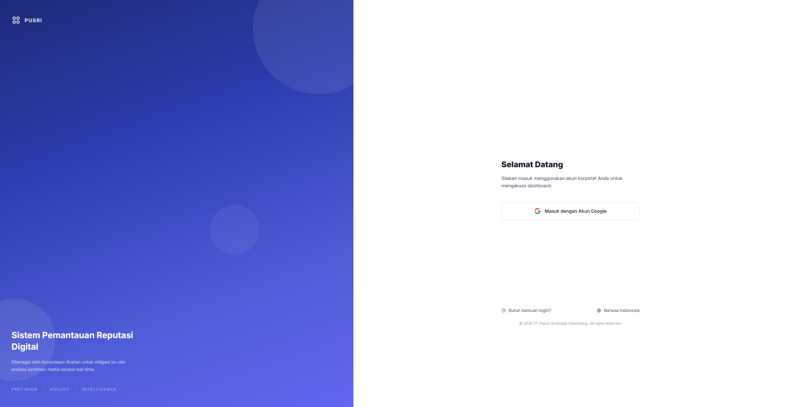
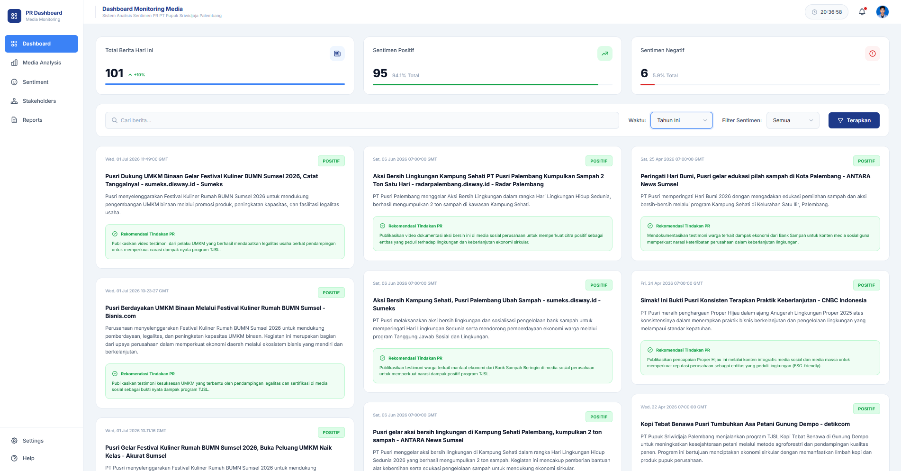
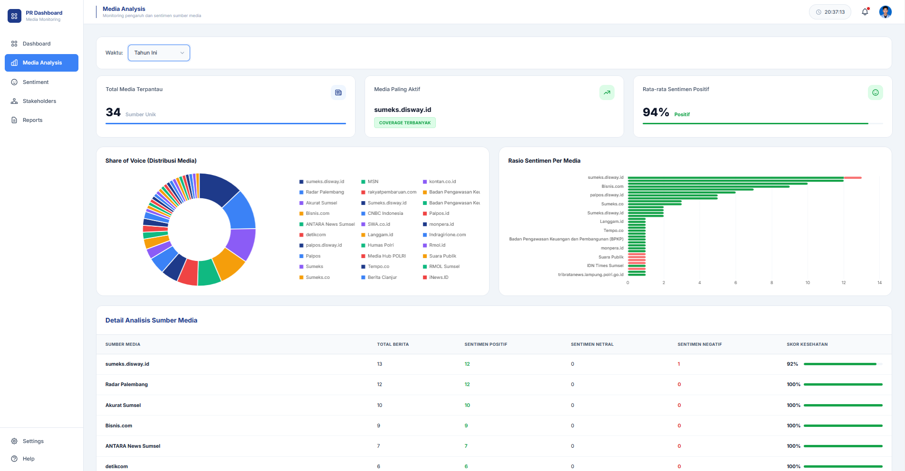
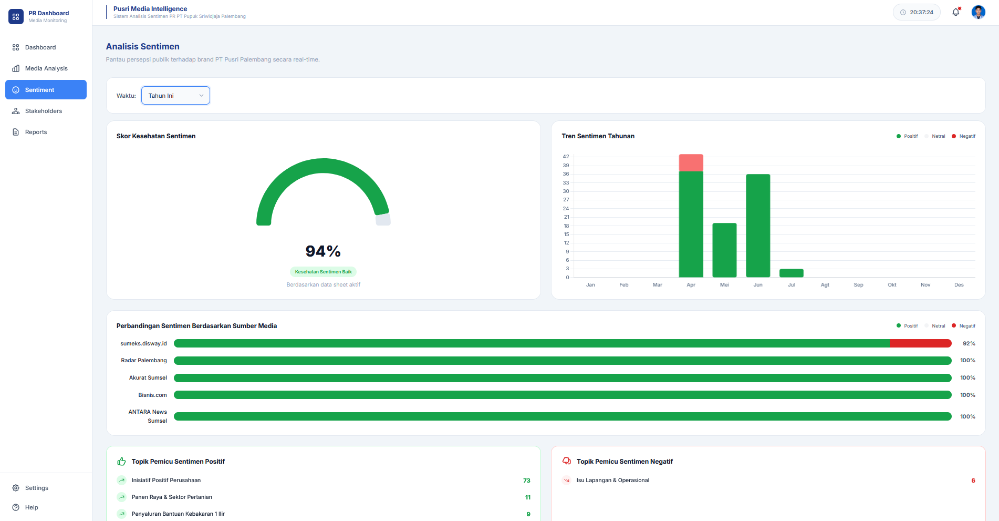
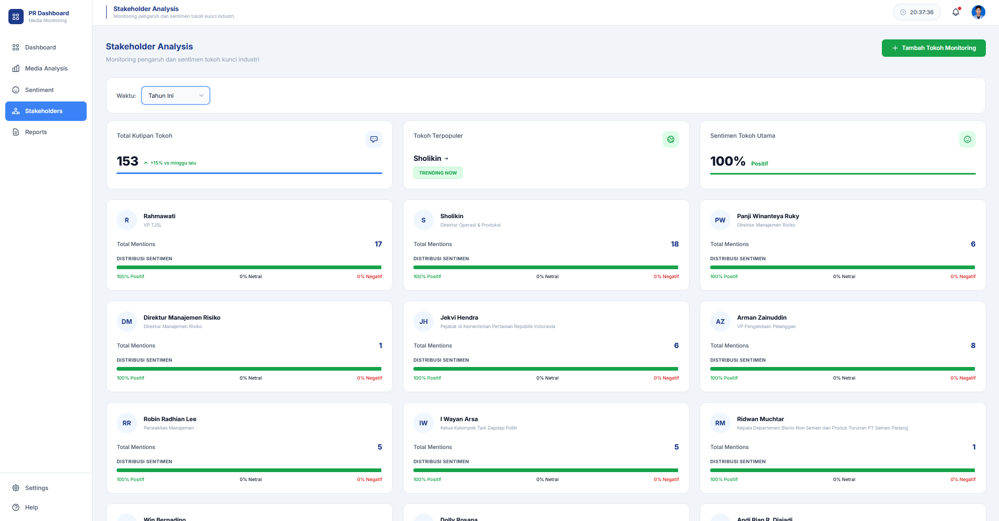
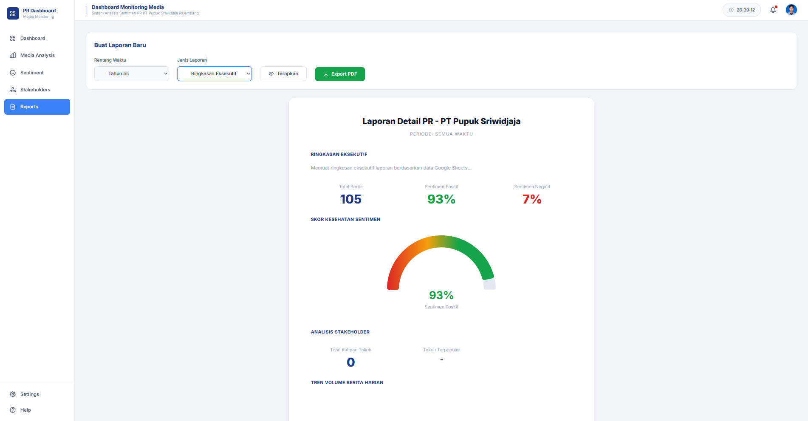

# 📡 PR Media Monitoring Dashboard

> **Sistem Pemantauan Reputasi Digital** — *Ditenagai oleh Kecerdasan Buatan untuk mitigasi isu dan analisis sentimen media secara real-time.*

Sebuah dashboard web berbasis **Vanilla HTML, CSS, dan JavaScript** yang dirancang khusus untuk tim **Public Relations PT Pupuk Sriwidjaja Palembang (Pusri)**. Sistem ini memungkinkan pemantauan pemberitaan media secara otomatis, analisis sentimen, monitoring stakeholder, dan pembuatan laporan PR — semuanya terintegrasi langsung dengan **Google Sheets** sebagai sumber data.

---

## 🖥️ Preview

| Halaman | Screenshot | Deskripsi |
|---|---|---|
| **Login** |  | Halaman autentikasi Google OAuth |
| **Dashboard** |  | Ringkasan berita harian beserta statistik sentimen |
| **Media Analysis** |  | Breakdown pemberitaan per sumber media |
| **Sentiment** |  | Analisis tren sentimen dengan grafik interaktif |
| **Stakeholders** |  | Monitoring kutipan & sentimen tokoh kunci |
| **Reports** |  | Generator laporan PR dengan ekspor PDF |

---

## ✨ Fitur Utama

### 🔐 Autentikasi
- **Login via Google OAuth 2.0** menggunakan Google Identity Services (GIS)
- Sistem **session management** berbasis `localStorage` dengan expiry 8 jam
- **Domain allowlist** — hanya email dari domain yang dikonfigurasi yang dapat login
- Auto-redirect ke halaman login jika sesi habis

### 📊 Dashboard Utama
- Kartu statistik real-time: **Total Berita**, **Sentimen Positif**, **Sentimen Negatif**
- Animasi angka *count-up* dan progress bar
- Grid kartu berita dengan **filter multi-kriteria** (waktu, sentimen, kata kunci)
- Live search dengan debounce 300ms
- Rekomendasi tindakan PR otomatis per berita (Positif / Negatif / Netral)

### 📈 Analisis Media
- Breakdown pemberitaan **per sumber/portal media**
- **Pie chart** distribusi media dengan Chart.js
- **Bar chart** perbandingan sentimen antar sumber media
- Tabel ranking media berdasarkan volume pemberitaan

### 🎭 Analisis Sentimen
- **Gauge chart** indeks sentimen keseluruhan
- **Tren sentimen** berbasis waktu (Mingguan / Bulanan / Tahunan)
- Deteksi kata kunci dominan positif & negatif
- Filter periode waktu dinamis

### 👥 Stakeholder Monitoring
- Profil kartu tokoh-tokoh kunci industri
- Tabel kutipan & pernyataan terbaru beserta sentimen
- Statistik: total kutipan, tokoh terpopuler, sentimen dominan
- Filter berdasarkan periode waktu

### 📄 Generator Laporan
- Tipe laporan: **Ringkasan Eksekutif**, **Analisis Tren**, **Laporan Detail**
- Pemilihan rentang tanggal dengan date range picker (Flatpickr)
- **Preview laporan** sebelum ekspor
- **Ekspor ke PDF** langsung dari browser

### ⚙️ Pengaturan Sistem
- Konfigurasi **URL Google Sheets** secara dinamis tanpa ubah kode
- Manajemen **domain allowlist** untuk kontrol akses pengguna
- Konfigurasi **Telegram Bot** untuk notifikasi
- Integrasi **n8n webhook** untuk otomasi alur kerja
- Manajemen **RSS Feed** sumber berita
- Panel notifikasi dengan toggle per kategori

### 🔔 Notifikasi Real-time
- Sinkronisasi data otomatis setiap **60 detik**
- Alert otomatis untuk berita dengan **sentimen negatif baru**
- Indikator status sinkronisasi di topbar
- Jam real-time di topbar

---

## 🏗️ Struktur Proyek

```
Media Monitoring/
├── .gitignore              # File yang diabaikan Git
├── README.md               # Dokumentasi ini
│
├── index.html              # Dashboard utama
├── login.html              # Halaman autentikasi Google
├── media-analysis.html     # Analisis sumber media
├── sentiment.html          # Analisis sentimen
├── stakeholders.html       # Monitoring stakeholder
├── reports.html            # Generator laporan PR
├── settings.html           # Pengaturan sistem
├── help.html               # Panduan pengguna
│
├── css/
│   └── style.css           # Stylesheet utama (~75KB, design system lengkap)
│
└── js/
    ├── config.example.js   # ✅ Template konfigurasi (aman, ada di Git)
    ├── config.js           # ⚠️  Konfigurasi aktual (di-gitignore, buat sendiri)
    ├── auth.js             # Autentikasi Google OAuth 2.0 & session management
    ├── app.js              # Global: sidebar, topbar, Google Sheets sync engine
    ├── dashboard.js        # Logika halaman dashboard
    ├── media-analysis.js   # Logika halaman analisis media
    ├── sentiment.js        # Logika halaman sentimen
    ├── stakeholders.js     # Logika halaman stakeholder
    ├── reports.js          # Logika generator laporan
    ├── settings.js         # Logika halaman pengaturan
    └── help.js             # Logika halaman bantuan
```

---

## 🔗 Integrasi & Dependensi

| Library | Sumber | Fungsi |
|---|---|---|
| **PapaParse v5.4.1** | CDN (Cloudflare) | Parsing CSV dari Google Sheets |
| **Chart.js** | CDN (jsDelivr) | Grafik interaktif (gauge, pie, bar, line) |
| **Flatpickr** | CDN (jsDelivr) | Date range picker di halaman Reports |
| **html2pdf.js** | CDN (Cloudflare) | Ekspor laporan ke PDF |
| **Google Identity Services** | `accounts.google.com/gsi/client` | Google OAuth 2.0 login |

> **Tidak ada framework JavaScript** (React, Vue, Angular) — murni Vanilla JS untuk performa maksimal dan kemudahan deployment.

---

## ⚙️ Cara Setup & Konfigurasi

### Prasyarat
- **Web server** lokal atau hosting (XAMPP, WAMP, Apache, Nginx, dll.)
- Akun **Google** dengan project di Google Cloud Console
- **Google Sheets** yang dipublikasikan sebagai CSV

### 1. Clone Repositori

```bash
git clone https://github.com/username/media-monitoring.git
cd media-monitoring
```

### 2. Buat File Konfigurasi

```bash
# Salin template konfigurasi
cp js/config.example.js js/config.js
```

Buka file `js/config.js` dan isi dengan nilai Anda:

```javascript
const APP_CONFIG = {
  GOOGLE_CLIENT_ID: 'ISI_CLIENT_ID_ANDA.apps.googleusercontent.com',
  GOOGLE_SHEETS_CSV_URL: 'https://docs.google.com/spreadsheets/d/e/ID_SHEETS_ANDA/pub?output=csv',
};
```

> ⚠️ **Jangan pernah commit `js/config.js`** — file ini sudah terdaftar di `.gitignore`.

### 3. Konfigurasi Google OAuth Client ID

1. Buka [Google Cloud Console](https://console.cloud.google.com/)
2. Buat project baru atau pilih project yang ada
3. Pergi ke **APIs & Services** → **Credentials**
4. Klik **Create Credentials** → **OAuth 2.0 Client IDs**
5. Pilih **Web application**
6. Di bagian **Authorized JavaScript origins**, tambahkan URL server Anda:
   - `http://localhost` (untuk pengembangan lokal)
   - `https://domain-anda.com` (untuk production)
7. Copy **Client ID** yang dihasilkan ke `js/config.js`

### 4. Konfigurasi Google Sheets

Pastikan Google Sheets Anda memiliki kolom berikut:

| Kolom | Keterangan |
|---|---|
| `Tanggal` | Tanggal publikasi berita (format: YYYY-MM-DD) |
| `Judul Berita` | Judul artikel |
| `Ringkasan` | Ringkasan konten berita |
| `Sentimen` | Nilai: `Positif`, `Negatif`, atau `Netral` |
| `URL asli` | URL sumber berita |
| `Saran Tindakan` | Rekomendasi tindakan PR |
| `Nama Sumber` *(opsional)* | Nama portal media |
| `Nama Tokoh` *(opsional)* | Untuk fitur stakeholder monitoring |

**Cara mempublikasikan Sheets sebagai CSV:**
1. Buka Google Sheets → `File` → `Share` → `Publish to web`
2. Pilih sheet yang sesuai → Format: `Comma-separated values (.csv)`
3. Klik **Publish** dan copy URL yang dihasilkan ke `js/config.js`

### 5. Konfigurasi Domain Allowlist (Opsional)

Setelah login pertama, buka halaman **Settings** untuk membatasi akses hanya ke email dari domain tertentu (misalnya `pusri.co.id`). Jika dibiarkan kosong, semua akun Google dapat login.

### 6. Jalankan Aplikasi

Letakkan folder di direktori web server dan akses via browser:

```
# XAMPP (Windows)
http://localhost/media-monitoring/login.html

# Python HTTP Server (alternatif cepat)
python -m http.server 8000
# Lalu buka: http://localhost:8000/login.html
```

---

## 🔄 Alur Data

```
Google Sheets (Sumber Data)
        │
        │ CSV via PapaParse (auto-sync tiap 60 detik)
        ▼
    app.js (Sync Engine)
        │
        ├──▶ dashboard.js      → Kartu berita & statistik
        ├──▶ sentiment.js      → Grafik tren sentimen
        ├──▶ media-analysis.js → Breakdown per media
        ├──▶ stakeholders.js   → Profil & kutipan tokoh
        └──▶ reports.js        → Generator laporan PDF
```

---

## 🔒 Keamanan

| Item | Status | Keterangan |
|---|---|---|
| Google OAuth Client ID | ✅ Aman | Disimpan di `config.js` (gitignored) |
| Google Sheets URL | ✅ Aman | Disimpan di `config.js` (gitignored) |
| Telegram Bot Token | ✅ Aman | Disimpan di `localStorage` browser, tidak di kode |
| n8n Webhook URL | ✅ Aman | Disimpan di `localStorage` browser, tidak di kode |
| Session Data | ✅ Aman | `localStorage` + expiry 8 jam |

> **Catatan:** Google Sheets CSV URL yang dipublikasikan ke web bersifat semi-publik secara desain (siapa pun dengan URL bisa membacanya). Pastikan data di Sheets Anda tidak mengandung informasi yang benar-benar rahasia.

---

## 🎨 Design System

Proyek ini menggunakan **design system** berbasis CSS Custom Properties (variabel CSS) yang terpusat di `css/style.css`:

- **Color Tokens**: Warna primer, status (positif/negatif/netral), dan tema
- **Typography Scale**: Font size dari `xs` hingga `4xl` menggunakan `clamp()` responsif
- **Spacing System**: Skala konsisten dari `space-1` hingga `space-16`
- **Component Classes**: Sidebar, Topbar, Cards, Tables, Badges, Buttons, Forms
- **Animations**: Micro-animations pada hover, loading spinners, dan transisi halaman

---

## 🖼️ Tampilan Akhir

### 🔐 Halaman Login


### 📊 Dashboard Utama


### 📈 Media Analysis


### 🎭 Analisis Sentimen


### 👥 Stakeholder Monitoring


### 📄 Generator Laporan


---

## 📋 Versi

**v2.4.0** — © 2026 PT Pupuk Sriwidjaja Palembang. Seluruh Hak Cipta Dilindungi.

---

## 🤝 Kontribusi

Proyek ini dikembangkan untuk kebutuhan internal tim PR PT Pupuk Sriwidjaja Palembang. Untuk pertanyaan atau pengembangan lebih lanjut, silakan hubungi tim IT Support.

---

## 📝 Lisensi

Proyek ini merupakan **proprietary software** milik PT Pupuk Sriwidjaja Palembang. Tidak diperkenankan untuk didistribusikan atau digunakan di luar lingkungan perusahaan tanpa izin tertulis.
